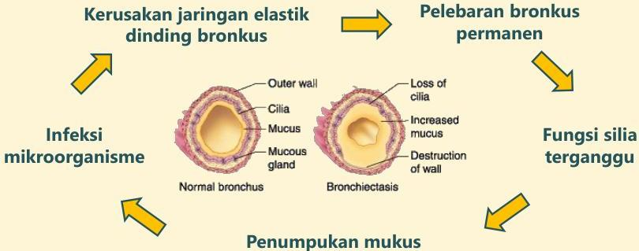
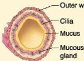

Atria.

# Bronkiektasis

## Patofisiologi

## Kerusakan jaringan elastik dinding bronkus

## Infeksi mikroorganisme

Normal bronchus

## Pelebaran bronkus permanen

## Fungsi silia terganggu

## Penumpukan mukus