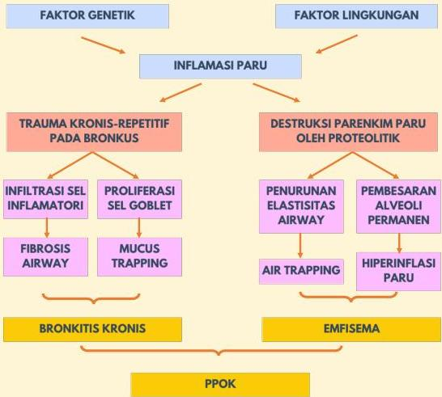

Atria.

FAKTOR GENETIK

FAKTOR LINGKUNGAN

INFLAMASI PARU

TRAUMA KRONIS-REPETITIF PADA BRONKUS

INFILTRASI SEL INFLAMATORI

FIBROSIS AIRWAY

PROLIFERASI SEL GOBLET

MUCUS TRAPPING

BRONKITIS KRONIS

DESTRUKSI PARENKIM PARU OLEH PROTEOLITIK

PENURUNAN ELASTISITAS AIRWAY

AIR TRAPPING

PEMBESARAN ALVEOLI PERMANEN

HIPERINFLASI PARU

EMFISEMA

PPOK