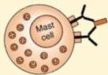
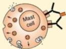

Atria.

PAPARAN TERHADAP ALERGEN

DEGRANULASI SEL MAST

PELEPASAN MEDIATOR INFLAMASI (HISTAMIN, LEUKOTRIEN)

VASODILATASI

EDEMA SALURAN NAPAS

HIPERPLASIA SEL GOBLET

HIPERSEKRESI MUKUS

# Patogenesis Asma

KONTRAKSI OTOT POLOS BRONKUS