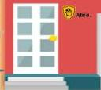
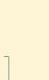

Atria.

# Persisten Berat

ICS dosis menengah + LABA

# Persisten Sedang

ICS dosis rendah + LABA

# Persisten Ringan

ICS dosis rendah

# Intermiten

Tidak perlu controller

+ SABA (pereda/reliever)
+ hindari faktor pencetus (allergen)
+ atasi penyakit komorbid

# Tata Laksana Pengendalian Asma

Sumber: Pedoman Nasional Asma Anak. 2015