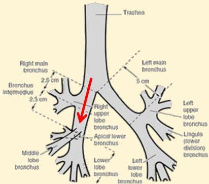

Atria.

# Pneumonia Aspirasi

## Pemeriksaan Penunjang:

- Analisa gas darah
- Rontgen thoraks: lokasi infiltrat berdasarkan posisi pasien saat aspirasi
- Posisi supine → segmen superior dari lobus kanan bawah
- Posisi berdiri/duduk → segmen basal dari lobus kanan bawah

