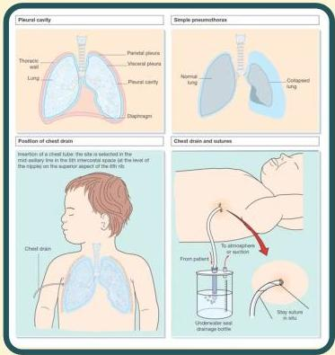

Atria.

# Water Sealed Drainage

## Definisi

Sistem drainase yang kedap air untuk mengalirkan udara dan cairan dari pleura

## Tujuan

Untuk membuat tekanan intrapleura yang positif menjadi negatif

