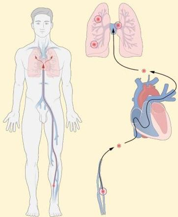

Atria.

# Emboli Paru

## Patofisiologi:

1. Trias Virchow
- Kerusakan endotel (inflames, trauma)
- Stasis vena (mis. varises, imobilisasi)
- Hiperkoagulabilitas (mis. thrombophilia, kehamilan, dll)

2. DVT pada ekstremitas bawah
3. Embolisasi ke arteri paru