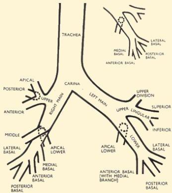

Atria.

# Aspirasi Benda Asing

## Manifestasi Klinis

- Bronkus → bronkus kanan (80%) karena anatominya yang lebih lurus dan pendek
- Sering asimtomatis
- Wheezing dan ekspirasi memanjang
- Suara napas ↓ paru ipsilateral
- Batuk, sesak nafas, hemoptisis, demam, dan sianosis dapat terjadi → karena late diagnosis

