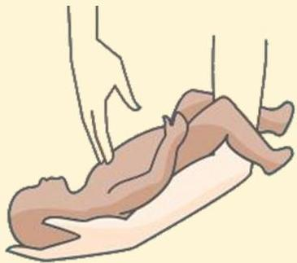

Atria.

# Chest Thrust

Posisi bayi terlentang

Berikan pijatan dada dengan menggunakan 2 jari, satu hari di bawah garis yang menghubungkan kedua papila mammae

Sumber Gambar: Vikram Hospital, Bengaluru, India