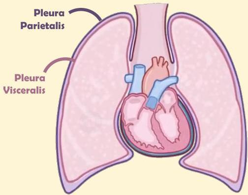

Atria.

# Anatomi Sederhana

Pleura manusia memiliki 2 lapisan, yakni **pleura parietalis dan visceralis**

Di antara kedua pleura ini terdapat ruang yang disebut **cavum interpleura** dan berisi cairan pleura