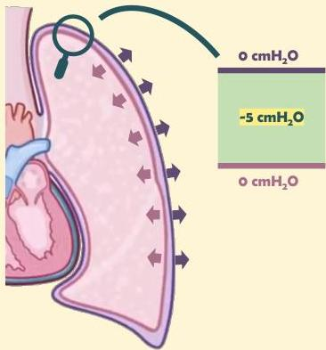

Atria.

# Anatomi Sederhana

Paru cenderung menekan ke dalam, sedangkan dinding dada cenderung menekan ke luar

Hal ini menyebabkan terdapat tekanan negatif pada cavum interpleura yang menjaga paru tetap mengembang (-5 cmH₂O).