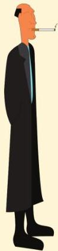
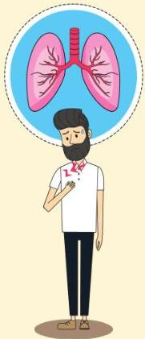

Pneumotoraks spontan

Primer

Tanpa didasari penyakit paru

Sekunder

Komorbid penyakit paru (+)

Atria.

Pneumotoraks spontan primer biasanya dialami oleh pria dengan postur kurus dan tinggi, misalnya pada kasus Sindrom Marfan