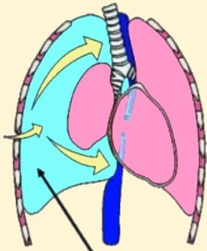

Atria.

Udara dalam rongga pleura

# Tension Pneumothorax

"One-way valve mechanism"

Udara dapat masuk ke rongga pleura, namun tidak dapat keluar → tekanan pleura tinggi → mediastinal shift dan kompresi struktur mediastinum

Sumber Gambar: Orthobullets.com