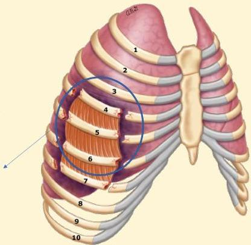

Atria.

# Flail Chest

Definisi: Gerak paradoksikal dinding dada akibat fraktur kosta multipel

Biasanya dibutuhkan fraktur 3 kosta berurutan pada 2 tempat sehingga segmen tersebut kehilangan kontinuitas (floating) dari komponen dinding dada lainnya

Segmen Flail