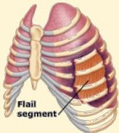
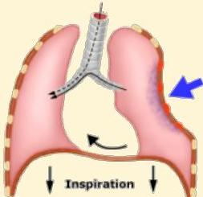
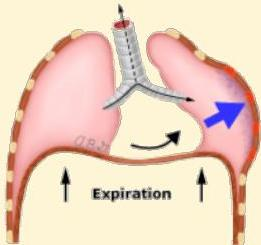

Atria.

# Gerak Dada Paradoksikal

A

B

C

A. Flail chest terjadi bila terdapat fraktur iga multipel yang berurutan, sehingga menimbulkan instabilitas dinding dada
B. Inspirasi → tekanan negatif, sehingga segmen flail teretraksi ke dalam
C. Ekspirasi → tekanan positif, sehingga segmen flail justru terdorong ke luar