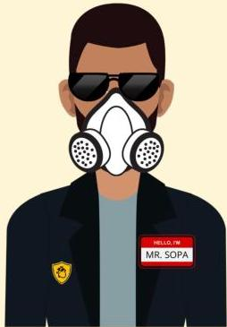

Atria.

# Koreksi Ventilasi

|  Langkah Koreksi | Metode  |
| --- | --- |
|  Mask adjustment | Teknik 2 tangan  |
|  Reposition airway | Pastikan posisi leher netral atau sedikit hiperekstensi  |
|  Suction mouth and nose | Menggunakan bulb syringe atau suction catheter  |
|  Open mouth | Buka mulut dan angkat rahang ke depan  |
|  Pressure increase | Tingkatkan tekanan 5-10 cmH2O, maksimal 50 cm H2O  |
|  Alternative airway | ETT atau laryngeal mask  |