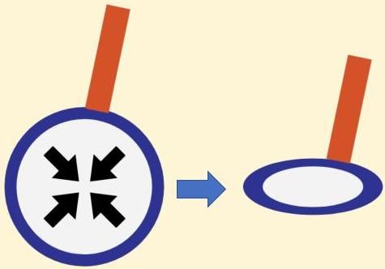

Atria.

Alveolus dengan lapisan air saja

Setiap cairan memiliki tegangan permukaan, yaitu ikatan antar molekul serapat mungkin. Gaya ini menyebabkan permukaan alveolus cenderung kolaps karena alveolus dilapisi oleh air