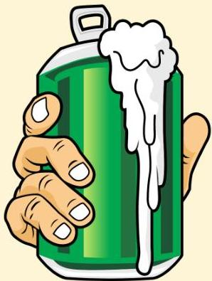

Tekanan udara yang berkurang tiba-tiba

Terbentuk gelembung udara

Gelembung udara pada pembuluh darah menyebabkan keluhan

Atria.

Hal ini dapat dilihat bila kita membuka kaleng minuman besoda, karena terjadi penurunan tekanan mendadak, maka timbul buih dan gelembung udara dalam jumlah banyak