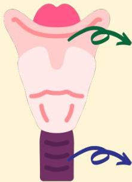

Atria.

# Croup

Patofisiologi → pathogen berkolonisasi di area nasofaring, lalu turun ke laring dan trakea dan menyebabkan inflamasi

Edema Laring

Suara serak (hoarseness)

"Barking" cough (saat ekspirasi)

Edema Trakea

Stridor inspiratori

Distress napas