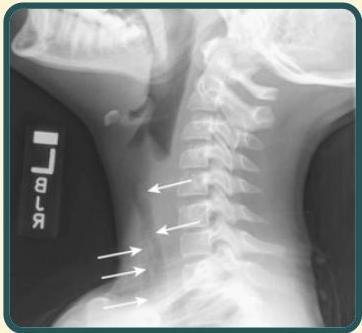

Atria.

# Trakeitis Bakterial

## Pemeriksaan Penunjang:

- Foto rontgen leher lateral atau PA → penyempitan trakea subglotis yang menyerupai croup, namun disertai **margin yang ireguler** atau tampak bayangan opak linear/ireguler didalam lumen trakea

**Candle dripping sign**