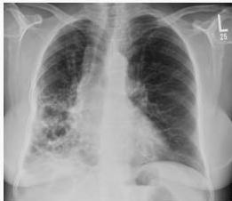

#

# Soal 20

Seorang pria berusia 76 tahun, datang ke IGD dengan keluhan utama sesak napas yang semakin memberat dalam 2 hari terakhir. Keluhan disertai dengan batuk dan demam tinggi. Pada pemeriksaan fisik didapatkan S 38,7C. Pemeriksaan CXR menunjukkan hasil sebagai berikut.

## Apa diagnosis yang tepat pada pasien ini?

A. Bronkiolitis
B. Bronkitis
C. Bronkiektasis
D. Empyema
E. Hemoptisis

Kelon Complete Batch Nov 2025

MEDIKO.ID

A