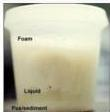

REGION

# RASIONALE

Hasil CXR menunjukan gambaran tramtrack line appearance → khas pada BRONKIEKTASIS

A. Sputum mukoid berdarah (tidak tepat)
B. Sputum purulent dan berbau (tidak tepat)
C. Sputum purulent dan berdarah (tidak tepat)
D. Sputum 3 lapis, berbusa
E. Sputum purulent berbusa (tidak tepat)

Sputum 3 lapis pada bronkiektasis:
- Busa
- Saliva/cairan jenih
- Pus/endapan

Kelon Complete Batch Nov 2025

MEDIKO.ID

ASSOCIATION OF MEDICINE