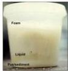

#

# RASIONALE

Keluhan utama sesak napas yang semakin parah, didahului batuk dan demam sampai menggigil + Pemfis S 38,9C, SpO2 93% RA + Pemeriksaan sputum ditemukan sputum 3 lapis dan tampak berbuih → khas pada BRONKIEKTASIS

A. Eggshell calcification (silikosis)
B. Cavitas, fibrotik, dan kalsifikasi (TB paru)
C. Tram-track line appearance
D. Air bronchogram (pneumonia)
E. Hiperinflasi dengan air-trapping (bronkiolitis)

Sputum 3 lapis pada bronkiektasis:
- Busa
- Saliva/cairan jenih
- Pus/endapan

Kelon Complete Batch Nov 2025

MEDIKO.ID

Referensi: Soal UKMPPD Mei 2022