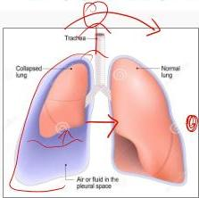

3B

# EFUSI PLEURA

vs atelectans → Sim Salut

- Penumpukan cairan pada rongga pleura
- Normalnya → hanya ada cairan serous (lubrikan pleura) sebanyak 10-20 cc

# MANIFESTASI KLINIS

- Sesak adalah tanda utama, apabila sudah ada efusi dalam jumlah banyak (&gt;500 mL)
- Tidur miring ke arah sehat → semakin sesak
- Nyeri dada
- Gejala lainya berkaitan dengan etiologi dari efusi pleura

# PEMERIKSAAN FISIK

- Inspeksi : gerak dada asimetris
- Palpasi : fremitus taktil ↓
- Perkusi : redup
- Auskultasi : suara napas ↓, egofoni (+)

Kelon Complete Batch Nov 2025

MEDIKO.ID

(PDPI, 2021) Hal. 171

3B