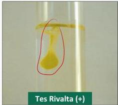
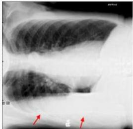
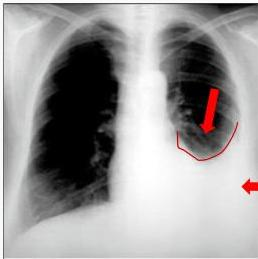

#

# PEMERIKSAAN PENUNJANG

- Foto Xray Thorax PA dan RLD
- Parasentesis cairan pleura : mengevaluasi pH, protein, LDH, kolesterol, glukosa
- Tes Rivalta: (+) pada eksudat

# Right Lateral Decubitus

(mendeteksi 50 ml cairan)

Menghitung pleural effusion index

# X Foto Thorax AP

(mendeteksi 250-300 ml cairan)

- Sudut costofrenikus tumpul
- Meniscus sign

Kelon Complete Batch Nov 2025

MEDIKO.ID

(PDPL 2021) Hal. 171

3B

2