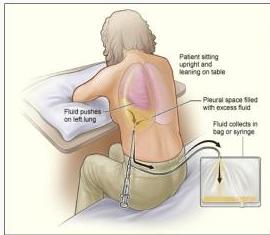
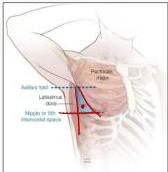

LIGHT'S CRITERIA

s-6-7

TATALAKSANA

|   | Light's Criteria  |   |
| --- | --- | --- |
|   |  Transudate | Exudate  |
|  Pleura : Serum Protein | < 0,5 | > ≥ 0,5  |
|  Pleural : Serum LDH | <0,6 | > ≥ 0,6  |
|  Pleural fluid LDH | < 2/3 upper limit or normal | > 2/3 upper limit or normal  |
|  Main Causes | • Heart failure
• Cirrhosis
• Nephrotic syndrome
• Pulmonary embolism | • Malignancy
• Bacterial /viral pneumonia
• Tuberculosis
• Pulmonary embolism
• Pancreatitis
• Esophageal rupture
• Collagen vascular disease
• Chylothorax/Hemothorax  |

1. Thoracocentesis terapeutik pada triangle of safety (bila kondisi pasien tidak stabil)
- Lateral pectoralis mayor
- Lateral latisimus dorsi
- Sejajar lipat payudara (SIC V)

2. Watersealed drainage (WSD) (bila kondisi pasien stabil)

Kelon Complete Batch Nov 2025

MEDIKO.ID

(Jany et al, 2019) Hal. 171