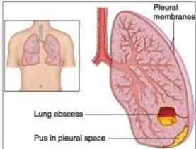

ABSES PARU

Infeksi intraparu yang mengakibatkan **nekrosis jaringan**, mengalami supurasi

## PEMERIKSAAN FISIK

- Suara nafas bronchial, **amforik** (seperti meniup botol kosong)
- Ronki basah kasar
- Krepitasi

Hati-hati membedakan abses paru dan emphyema

## GEJALA

Benyerupai pneumonia (batuk berdahak, demam)

Bakteri anaerob → **Peptostreptococcus**, **Fusobacterium**, **Prevotella**, **Bacteroides**
Bakteri aerob → **Streptococcus sp.**, **Staphylococcus sp.**

Aspirasi dari sekresi oral (etiologi tersering), akibat gingivitis atau poor oral hygiene

Hematogen
Suppurative
thromboembolism

Endotracheal obstruction

Sakit Gigi → poor oral hygiene (aspirasi sekresi oral) sebagai etiologinya

Linda → **Klindamycin 600 mg IV terapinya**

Flu → **Air Fluid** level gambaran radiologisnya

MEDIKOLOGIC

Kelon Complete Batch Nov 2025

MEDIKO.ID

(PDPI, 2021) Hal. 44

3A