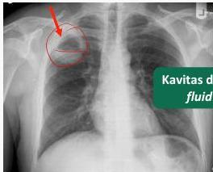

3A

# PEMERIKSAAN PENUNJANG

- Pemeriksaan laboratorium → leukositosis, peningkatan LED
- X-foto Thorax: kavitas dengan air fluid level
- CT Scan: gambaran hipoekoik
- Analisis mikrobiologi (bronchoalveolar lavage - BAL)

# TATALAKSANA

- Terapi suportif → hidrasi, diet, antipiretik
- Fisioterapi dada
- Antibiotik empiris
- ✓ Klindamisin 3 x 600 mg IV (hari 1) → 4 x 150-300 mg PO (hari berikutnya); tatalaksana hingga terjadi resolusi pada foto thorax (3-6 minggu)

Apabila tidak respon terhadap antibiotik maka perlu dilakukan drainase secara percutaneous atau operatif

Kelon Complete Batch Nov 2025

MEDIKO.ID

(PDPI, 2021) Hal. 44

3A