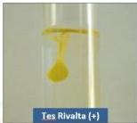

#

# RASIONALE

Pemeriksaan thorax didapatkan perkusi (redup/sonor), taktil fremitus (↓/+), suara vesikuler (↓/+), ronki (+/+) + Radiologi thorax dan didapatkan hasil hemithorax dextra tertutup perselubungan opak (+), sudut kostofrenikus tumpul, meniscus sign (+) → khas EFUSI PLEURA

A. Tes endapan (tidak tepat)
B. Kultur bakteri (tidak tepat)
C. Tes Rivalta
D. Thoracocentesis (tatalaksana)
E. Tes light (light’s criteria, kriteria untuk membedakan cairan transudate dan eksudat)

- X Foto Thorax PA dan RLD
- Parasentesis cairan pleura : Mengevaluasi pH, protein, LDH, kolesterol, glukosa
- Tes Rivalta: (+) pada eksudat

Kelon Complete Batch Nov 2025

MEDIKO.ID

Referensi: Soal UKMPPD Mei 2022