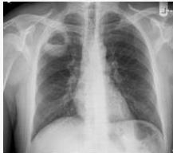

#

# Soal 25

Seorang pria berusia 67 tahun, datang ke klinik infeksi dengan keluhan utama batuk berdahak berwarna kecoklatan sejak 1 minggu yll. Pasien juga mengeluhkan demam tinggi dan dada terasa nyeri. Diketahui pasien hobi mengkonsumsi alkohol. Pada pemeriksaan fisik didapatkan TD 132/79 mmHg, N 83x/menit, R 20x/menit, S 38,8C, SpO2 98% RA, perkusi pekak pada apex paru kanan, rhonki +/+, suara amforik +/-. Dilakukan CXR dengan hasil sebagai berikut.

## Apa diagnosis pasien ini?

A. Bronkiektasis
B. Kanker paru
C. Pneumonia
D. Efusi pleura
E. Abses paru

Kelon Complete Batch Nov 2025

MEDIKO.ID

A