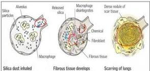

PNEUMOKONIOSIS

Pekepuan Yarnem

Penyakit paru akibat inhalasi partikel organik/non organik debu → menyebabkan inflamasi

|  Inhalan | Nama Penyakit | Tempat exposure | Karakteristik  |
| --- | --- | --- | --- |
|  Silika | Silikosis | Pabrik besi, baja, keramik, beton, timah putih | Egg shell classification  |
|  Asbestos | Asbestosis | Pemintalan asbes, pekerja galangan kapal | Pleural plaque  |
|  Kapas | Bisinosis/Monday fever | Pemintalan kapas, pabrik tekstil, gudang kapas | Monday Disease --> batuk dan sesak pada hari pertama kerja  |
|  Tebu | Bagassosis | Perkebunan tebu |   |
|  Spora | Farmer’s lung | Perkebunan |   |
|  Batu bara | Antrakosis/black lung disease | Pekerja tambangbatubara | Focal and Interstitial fibrosis  |
|  Berilium | Beriliosis | Pabrik seng (bentuk silikat) dan mangan |   |

# PATOGENESIS

# GEJALA KLINIS BSD

- Batuk lama, sesak nafas, demam
- Lanjutan → penurunan berat badan, gagal jantung

Kelon Complete Batch Nov 2025

MEDIKO.ID

(PDPI, 2021) Hal. 132-144