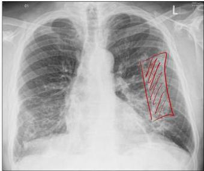
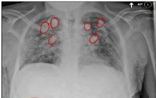
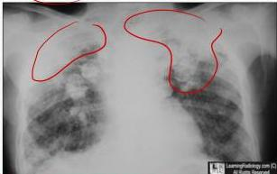

2

# GAMBARAN RADIOLOGIS

## Asbestosis

(opasitas irregular dengan gambaran reticular GGO) Grooved glass apomn

Pleum Plague

## Silicosis: Legg shell calcification)

## Antrakosis (nodul pada area posterosuperior)

Kelon Complete Batch Nov 2025

MEDIKO.ID

(PDPI, 2021) Hal. 132-144