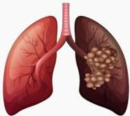

2

# KARSINOMA PARU

Tumor ganas yang berasal dari epitel bronkus (bronchogenic carcinoma)

Di Indonesia: Terbanyak ketiga setelah kanker payudara dan kanker serviks

## FAKTOR RISIKO

- Paparan radiasi
- Paparan okupasi terhadap bahan karsinogenik
- Riwayat keganasan pada keluarga
- Riwayat merokok aktif/pasif
- Riwayat PPOK atau TB

## GEJALA KLINIS

- Batuk kronis
- Batuk berdarah
- Nyeri dada
- Sesak napas
- Pembengkakan/benjolan pada leher
- Suara serak
- BB turun
- Demam lama

Berlangsung lebih dari 2 minggu walaupun dengan pengobatan standar

Kelon Complete Batch Nov 2025

MEDIKO.ID

(KEMENKES KANKER PARU, 2023. Hal. 14)