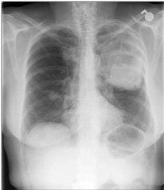

2

# PEMERIKSAAN PENUNJANG

- X foto toraks PA dan lateral
- CT Scan toraks dengan kontras
- MRI toraks tanpa kontras
- Bone Scan scintigraphy (bila curiga metastasis tulang)
- Gold Standard: histopatologi

**Non small-cell lung carcinoma**

85% dari karsinoma paru Contoh: Karsinoma sel skuamosa, adenokarsinoma, giant cell carcinoma

**Small-cell lung carcinoma**

Kurang respon terhadap terapi, lebih progresif, mudah kambuh

Kelon Complete Batch Nov 2025

MEDIKO.ID

(KEMENKES KANKER PARU, 2023, Hal. 15)