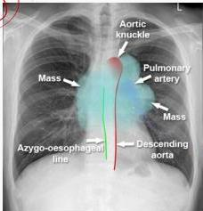
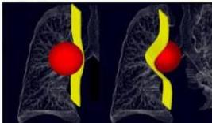

TUMOR MEDIASTINUM

# Definisi

Kanker yang berada di rongga mediastinum, kanker mediastinum dan neoplasma maligna primer mediastinum

# Manifestasi Klinis

- Keluhan respirasi: batuk kronik, hemoptisis, sesak napas, nyeri dada, suara serak
- Keluhan sistemik: BB turun, malaise, nafsu makan turun, demam hilang-timbul, sindrom paraneoplastik
- Gerak nafas tertinggal, venektasi, fremitus mengeras, perkusi redup, suara nafas menurun pada sisi sakit

Tumor mediastinum vs Tumor paru

MEDIKOLOGIC "NUMPUL"

Tumor mediastinum membentuk sudut tumpul

# Diagnosis Banding

- Kanker paru (Small cell atau non small cell)
- Tuberculosis mediastinum
- Aneurisma aorta

Kelon Complete Batch Nov 2025

MEDIKO.ID

Panduan Umum Praktik Klinis Penyakit Paru dan Pernapasan. Perhimpunan Dokter Paru Indonesia (PDPI) 2021