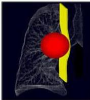
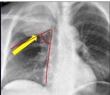
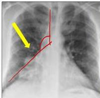
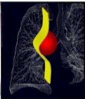

2

|   | KARSINOMA PARU | TUMOR MEDIASTINUM  |
| --- | --- | --- |
|  ASAL | Berasal dari parenkim paru atau epitel bronkus
Faktor risiko: **merokok** | Berasal dari organ-organ mediastinum
Mediastinum anterior: **timoma**, limfoma mediastinum
Mediastinum media: **adenoma paratiroid**
Mediastinum posterior: **schwannoma**  |
|  GEJALA KLINIS | Batuk kronik, batuk berdarah, nyeri dada, sesak napas, benjolan pada leher, suara serak, wajah bengkak, distensi vena leher.  |   |
|  X-Ray Thoraks | Massa pada parenkim paru
Massa membentuk **sudut lancip** dengan batas mediastinum | Massa pada mediastinum
Massa membentuk **sudut tumpul** dengan batas mediastinum  |

Kelon Complete Batch Nov 2025

MEDIKO.ID

ASSOCIATION OF MEDICINE