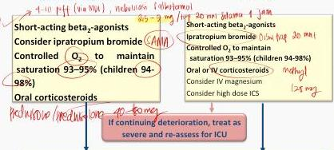
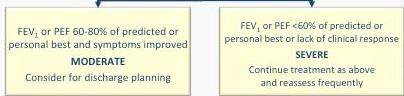

TATALAKSANA ASMA EKSASERBASI AKUT

# INITIAL ASSESSMENT

A: airway B: breathing C: circulation

Are any of the following present?

Drowsiness, Confusion, Silent chest

NO

YES

Further TRIAGE BY CLINICAL STATUS according to worst feature

Consult ICU, start SABA and $\mathrm{O}_2$, and prepare patient for intubation

# MILD or MODERATE

Talks in phrases

Prefers sitting to lying

Not agitated

Respiratory rate increased

Accessory muscles not used

Pulse rate 100–120 bpm

$\mathrm{O}_2$ saturation (on air) 90–95%

PEF &gt;50% predicted or best

# SEVERE

Talks in words

Sits hunched forwards

Agitated

Respiratory rate &gt;30/min

Accessory muscles being used

Pulse rate &gt;120 bpm

$\mathrm{O}_2$ saturation (on air) &lt; 90%

PEF ≤50% predicted or best

# MILD or MODERATE

Short-acting beta₂-agonists

Consider ipratropium bromide

Controlled $\mathrm{O}_2$ to maintain saturation 93–95% (children 94–98%)

Oral corticosteroids

# SEVERE

Short-acting beta₂-agonists

Ipratropium bromide 0.6 mg/kg 30 min

Controlled $\mathrm{O}_2$ to maintain saturation 93–95% (children 94–98%)

Oral or IV corticosteroids

Consider IV magnesium

Consider high dose ICS

# ASSESS CLINICAL PROGRESS FREQUENTLY

# MEASURE LUNG FUNCTION

in all patients one hour after initial treatment

FEV₁ or PEF 60–80% of predicted or personal best and symptoms improved

# MODERATE

Consider for discharge planning

FEV₁ or PEF &lt;60% of predicted or personal best or lack of clinical response

# SEVERE

Continue treatment as above and reassess frequently

Kelan Complete Batch Nov 2025

MEDIKO.ID

(GINA ASMA, 2004) Hal. 22

4