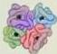
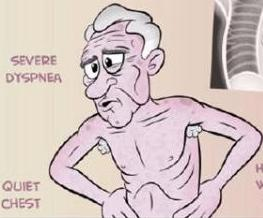

3 balan 2 th berlin²

# CHRONIC BRONCHITIS

CLINICAL DIAGNOSIS: DAILY PRODUCTIVE COUGH FOR THREE MONTHS OR MORE, IN AT LEAST TWO CONSECUTIVE YEARS

OVERWEIGHT AND CYANOTIC

ELEVATED HEMOGLOBIN

Blue Bloater
WWW.MEDCOMIC.COM

PERIPHERAL EDEMA

RHONCHI AND WHEEZING

# EMPHYSEMA

PATHOLOGIC DIAGNOSIS: PERMANENT ENLARGEMENT AND DESTRUCTION OF AIRSPACES DISTAL TO THE TERMINAL BRONCHIOLE

OLDER AND THIN

SEVERE DYSPNEA

QUIET CHEST

Pink Puffer

X-RAY: HYPERINFLATION WITH FLATTENED DIAPHRAGMS

© 2013 JORGE MUNIZ

Kelon Complete Batch Nov 2025

MEDIKO.ID

3A 3B