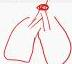
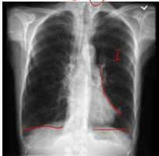
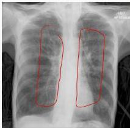

#

PEMERIKSAAN PENUNJANG

## SPIROMETRI

- FEV1 &lt; 80 % prediksi
- FEV1 / FVC &lt; 70 % (GOLD); &lt; 75% (pneumobile Indonesia)
- Uji bronkodilator: FEV1 paska bronkodilator &lt; 80 % prediksi

BGA dilakukan pada pasien dengan FEV1 &lt; 40% prediksi dan secara klinis gagal napas dan gagal jantung kanan

## X-FOTO THORAKS

- Emfisema: Hiperinflasi, hiperlusen, sela iga melebar, diafragma mendatar, jantung pendulum
- Bronkitis kronik: Peningkatan corakan bronkovaskular

## BRONKITIS KRONIK

Normal
Corakan bronkovaskular bertambah pada 21% kasus.

## EMFISEMA

- Hiperinflasi
- Hiperlusen
- Sela iga melebar
- Diafragma mendatar
- Jantung menggantung (jantung pendulum/teardrop/eye drop)

Kelon Complete Batch Nov 2025

MEDIKO.ID

(PDPI PPOK 2023, Hal 45)

3A

3B