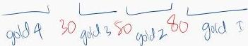

KLASIFIKASI PPOK (GOLD 2022)

Klasifikasi derajat beratnya obstruksi menurut GOLD

Kasifikasi mMRC

|  Pasien dengan FEV₁ / FVC < 0,70:  |   |   |
| --- | --- | --- |
|  GOLD 1: | Ringan | Nilai prediksi FEV₁ ≥ 80%  |
|  GOLD 2: | Sedang | Nilai prediksi 50% ≤ FEV₁ < 80%  |
|  GOLD 3: | Berat | Nilai prediksi 30% ≤ FEV₁ < 50%  |
|  GOLD 4: | Sangat Berat | Nilai prediksi < 30%  |

|  Derajat 0-4  |   |
| --- | --- |
|  mMRC Derajat 0 | Hanya sesak saat aktivitas berat  |
|  mMRC Derajat 1 | Sulit bernapas ketika jalan jauh atau jalan menanjak  |
|  mMRC Derajat 2 | Berjalan lebih pelan dari orang seusia karena sesak, atau harus berhenti jalan untuk nafas  |
|  mMRC Derajat 3 | Berhenti untuk nafas setelah jalan 100 m atau setelah atau jeda beberapa menit pada tingkat tersebut  |
|  mMRC Derajat 4 | Sangat sulit bernapas untuk meninggalkan rumah atau sesak saat berpakaian atau lepas pakaian  |

Kelon Complete Batch Nov 2025

MEDIKO.ID

(PDPI PPOK.2023, Hal 49)

3A

3B