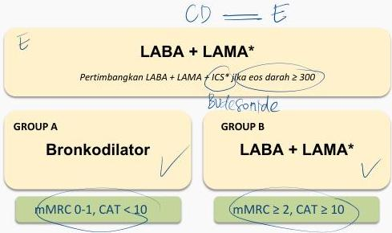

TATALAKSANA PPOK STABIL (GOLD 2023)

$\geq 2$ eksaserbasi sedang atau $\geq 1$ hingga menyebabkan perawatan di RS

0 atau 1 eksaserbasi sedang atau tidak menyebabkan perawatan RS

CD = E

LABA + LAMA*

Pertimbangkan LABA + LAMA + ICS* jika eos darah $\geq 300$

GROUP A

Bronkodilator

mMRC 0-1, CAT &lt; 10

GROUND B

LABA + LAMA*

mMRC $\geq 2$, CAT $\geq 10$

* Terapi inhaler tunggal mungkin lebih nyaman dan efektif daripada beberapa inhaler. Eksaserbasi mengacu pada jumlah eksaserbasi per tahun.

Kelon Complete Batch Nov 2025

MEDIKO.ID

(PDPI PPOK.2023, Hal 49)

3A

3B