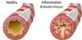
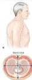

#

Chronic Bronchitis

Healthy Information &amp; excess mucus

# PPOK / COPD

## ① Keywords

- Inflamasi kronis berrifas progresif
- Hambatan oliran udara persisten

- Akibat paparan gas atau partikel
- Spironesti FEV1 / FVC &lt; 0,7 pas bronkodilator

# BRONKITIS KRONIS + EMFISEMA

Batuk kronis berdahak minimal 3 bulan dalam 1 tahun, bukan penyakit lain

Pelebaran rongga udara distal bronkialus &amp; kerusakan dinding a beoli

## ② Pemeriksaan Fisik

I : Pursed lip breathing, barrel chest, pelebaran sela-iga, pink puffer, blue bloater
P : Vocal fremitus melemah
P : Hipersonor, patas jantung mengecil, hepar terdorong ke bawah
A : Ronki atau mengi, ekspresi memanjang

## ③ Klasifikasi

GOLD I : Ringan, FEV1 &gt; 80%, prediksi
GOLD II : Sedang, 50% &lt; FEV1 &lt; 80%, prediksi
GOLD III : Berat, 30% &lt; FEV1 &lt; 50%, prediksi
GOLD IV : Sangat berat, FEV1 &lt; 30%, prediksi

## ④ Eksaserbasi

✓ Gejala : sesak bertambah, produksi sputum meningkat, perubahan warna sputum
✓ Pencetus : infeksi tracheobronchial tree

## ⑤ Tata Loksana

✓ Oksigen
✓ Inhalasi bronkodilator : Agonis Beta2 + Amikolinergik
✓ Antibiotik → jika sesak nafas, batuk memburuk, sputum purulen
✓ Glukokortikoid → 30-40 mg Prednisone PO (tambahan)

Kelon Complete Batch Nov 2025

MEDIKO.ID

3A 3B