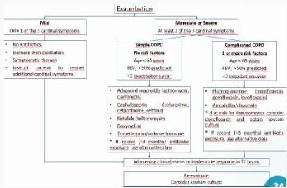

中

RATIONALE

Keluhan sesak yang semakin memberat disertai dengan batuk berdahak + Perokok berat + Pemfis SpO2 88%, tampak barrel chest, perkusi hipersonor kedua lapang paru → Dx. PPOK

A. Nebulizer Salbutamol (bronkodilator SABA)
B. Injeksi Metilprednisolon (bukan tatalaksana awal)
C. Injeksi Ceftriaxone (regimen antibiotik salah)
D. Inhalasi Budesonide (controller)
E. Tablet Prednison (bukan tatalaksana awal)

Kelon Complete Batch Nov 2025

MEDIKO.ID

ASSOCIATION FOR THE MEDICINE

^{}[]