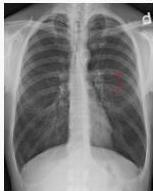

#

# Soal 9

Seorang Pria, 57 tahun, datang ke IGD RS dengan keluhan sesak napas yang semakin berat sejak 2 hari yll. Keluhan dikatakan sudah sering dialami sejak lama. Pasien juga mengeluhkan demam dan batuk berdahak sejak 2 minggu yll. Dikatakan akhir-akhir ini dahak berubah warna menjadi cokelat kehijauan. Pasien merupakan perokok aktif sejak 40 tahun yll. Pasien pernah dirawat di RS dengan keluhan serupa 2 tahun yll. Pada pemeriksaan didapatkan TD 152/86 mmHg, N 121x/menit, R 32x/menit, S 37,9°C, SpO2 94% RA. Tampak barrel chest, auskultasi rhonki dan wheezing kedua hemithorax. Rotgen thoraks seperti pada Gambar.

## Apa terapi yang tepat pada pasien ini?

A. Bronkodilator, kortikosteroid, dan analgesik
B. Bronkodilator, antihistamin, dan antibiotik
C. Bronkodilator, kortikosteroid, dan antibiotik
D. Bronkodilator, sel mast inhibitor, dan analgesik
E. Bronkodilator, mukolitik, dan antibiotik

Kelon Complete Batch Nov 2025

MEDIKO.ID

Referensi: Soal UKMPPD Mei 2022