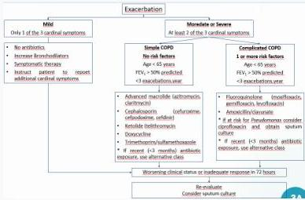

#

RATIONALE

Keluhan sesak napas yang semakin berat (increase dyspnea), disertai demam dan batuk berdahak, akhir-akhir ini dahak berubah warna menjadi cokelat kehijauan (increase sputum purulence) + Perokok aktif + Pemfis TD 152/86 mmHg, S 37,9°C, SpO2 94% RA, tampak barrel chest, rhonki dan wheezing kedua hemithorax + Rontgen didapatkan hiperinflasi dan jantung pendulum → Dx. PPOK EKSASERBASI AKUT

A. Bronkodilator, kortikosteroid, dan analgesic (tidak memerlukan terapi analgetik)
B. Bronkodilator, antihistamin, dan antibiotik (tidak perlu terapi antihistamin)
C. Bronkodilator, kortikosteroid, dan antibiotic
D. Bronkodilator, sel mast inhibitor, dan analgesik (tidak perlu terapi analgesik)
E. Bronkodilator, mukolitik, dan antibiotik (terapi mukolitik bukan terapi utama)

Kelon Complete Batch Nov 2025

MEDIKO.ID

Referensi: Soal UKMPPD Mei 2022