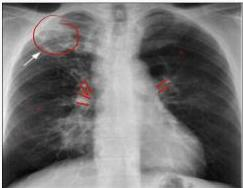

4

# TUBERKULOSIS PARU

Infeksi parenkim paru akibat *Mycobacterium tuberculosis* yang disebarkan melalui droplet

## GEJALA KLINIS

- ☑ Batuk berdahak 2-3 minggu, dahak bercampur darah
- ☑ Demam &gt;3 minggu
- ☑ Sesak nafas, malaise, penurunan nafsu makan
- ☑ Penurunan berat badan, keringat malam hari

## FOTO X-RAY TORAKS

- ☑ TB Aktif : Kavitas &gt;1, bayangan opak, bercak milier, pelebaran hilus (anak) → TB nalkif
- ☑ TB Inaktif : Fibrotik, kalsifikasi, penebalan pleura (schwarte sign)

## Pemeriksaan Bakteriologis

|  Pemeriksaan dahak mikroskopis | Sputum sewaktu dan pagi → cat BTA/Ziehl neelsen  |
| --- | --- |
|  Pemeriksaan tes cepat molekuler | Deteksi kuman M.Tb + resistensi terhadap Rifampicin  |
|  Kultur sputum | Media Lowenstein Jensen  |

## Pemeriksaan histopatologi

### Uji Resistensi

Kelon Complete Batch Nov 2025

MEDIKO.ID

(PDPI TB.2021, Hal 3)