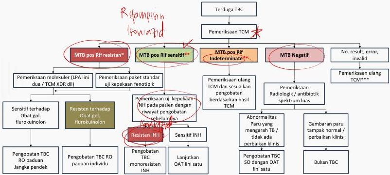

#

ALUR DIAGNOSIS

(Surat Edaran Perubahan Alur Diagnosis dan Pengobatan TB, 2021)

*Inisiasi pengobatan TBC-RO untuk kasus dengan riwayat pengobatan TBC. Sementara itu Hasil MTB dan R/f resisten dari kriteria terduga TB baru harus bulang dan hasil pengulangan (yang memberikan hasil MTB pos) yang menjadi acuan

**Inisiasi pengobatan
dengan OAT lini satu

***Pengulangan hanya 1 kali.
Hasil pengulangan yang menjadi acuan

Kelon Complete Batch Nov 2025

MEDIKO.ID

(SE KEMENKES,2021.Hal 3)

4

3A