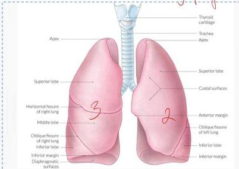
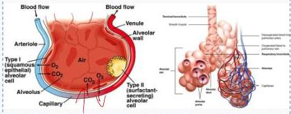
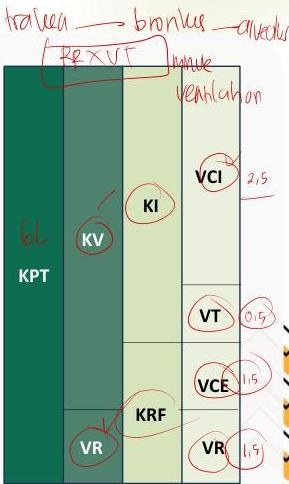

ANATOMI DAN FISIOLOGI

hidug fairy lang → upper lower → trachea → bronchus → alveolar

REXVT

|  KPT : Kapasitas Paru Total  |
| --- |
|  KV : Kapasitas Vital  |
|  VR : Volume Residu  |
|  KI : Kapasitas Inspirasi  |
|  KRF : Kapasitas Residu Fungsional  |
|  VCI : Volume Cadangan Inspirasi  |
|  VT : Volume Tidal  |
|  VCE : Volume Cadangan Ekspirasi  |
|  VR : Volume Residu  |

Venfian - aliran udara

Perfun - pernileerun gas

Kelon Complete Batch Nov 2025

MEDIKO.ID