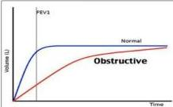
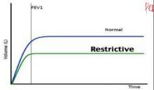

SPIROMETRI

# Penyakit Paru Obstruksi vs Restriktif

|   | Obstruksi | Restriktif  |
| --- | --- | --- |
|  Karakteristi | Limitasi dari aliran udara dikarenakan adanya obstruksi sebagian atau total | Penurunan kemampuan parenkim paru melakukan ekspirasi disertai dengan penurunan kapasitas total paru  |
|  Contoh Penyakit | • Empisema
• Bronkitis kronik
• Bronkiektasis
• Asma
• Trole | • Penyakit paru interstitial
• Idiopathic pulmonary fibrosis
• Pneumokoniosis
• Sarkoidosis
• Chest wall neuromuscular disease  |
|  Kapasitas Total Paru | Normal | Menurun  |
|  Kapasitas vital paksa (FVC) | Normal | Menurun  |
|  Volume Ekspirasi Paksa pada detik ke-1 (FEV₁) | Menurun | Normal atau menurun  |
|  Rasio FEV₁ / FVC | <0,7 | Normal  |

# = Metode untuk menilai fungsi paru-paru dengan mengukur jumlah volume udara yang dikeluarkan saat ekspirasi.

## Nilai normal

• FVC &gt; 80% → keeper of air
• FEV1 &gt; 80% → air
• FEV1/FVC &gt; 70%

WAJIB HAFAL!!

|   | Obstruksi | Restriksi | Mix  |
| --- | --- | --- | --- |
|  FEV1 | ↓ | ↓/Normal | ↓  |
|  FVC | Normal | ↓ | ↓  |
|  FEV1/FVC | ↓ | Normal | ↓  |

Contoh Asma (reversible), PPOK/COPD (irreversible) Atelektasis, efusi pelura Asma + pneumothorax

Kelon Complete Batch Nov 2025

MEDIKO.ID

A