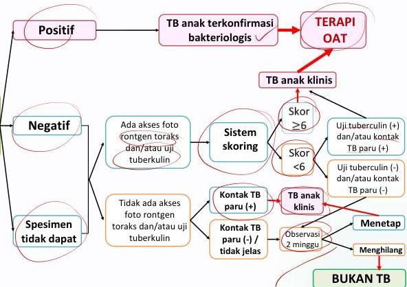

#

TB ANAK

#

MEDIKO.ID

ASSOCIATION FOR THE STUDY

# Alur Diagnosis

Anak dengan satu atau lebih gejala khas TB:
- Batuk ≥2 minggu ☑
- Demam ≥2 minggu ☑
- BB turun atau tidak naik dalam 2 bulan sebelumnya
- Malaise ≥2 minggu ☑

Gejala – gejala tersebut menetap walau sudah diberikan terapi yang adekuat

tx: ab non pat

@mediko.id

0821-3403-8758

Kelon Intensif MEDIKO UKMPPD 2025

#

(Kemenkes RI, 2019) Hal. 103

(Kemenkes RI, 2023) Hal. 31

4A